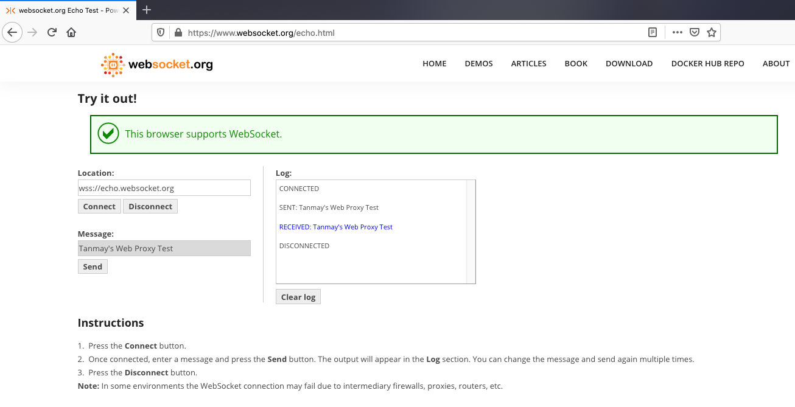
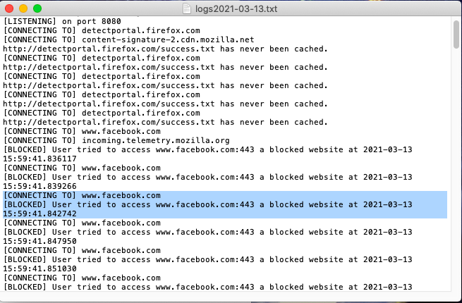
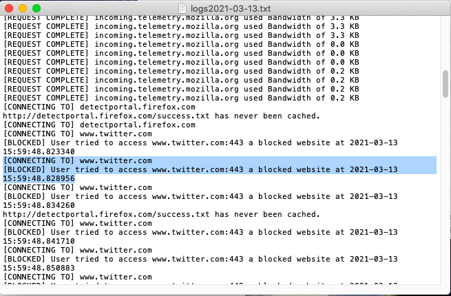

# Web-Proxy-Server
Developing a Web-Proxy Server which enables Website Caching, Blocking Features and other functionalities

# Requirements
Project is made to be used in Python 3. 
The Browser's network settings should be set to use the manual proxy with `localhost` as the name and Port Number used is `8080`
(I have been using Firerox as my browser for this project)

# HTTP and HTTPS Requests 
There are 2 types of requests -:
1) HTTP Requests
2) HTTPS Requsts

# Measure Time taken to retrieve a request from Server and Cache
When the first request is made, server retrieves the file and saves it in the cache. When that file is needed again, file in cache is used. Retrieving the file from cache is quite fast as compared to retrieving file from the server.

# Websockets
I tested Websockets functionality using the website ` https://www.websocket.org/echo.html `
This website lets you do an HTML5 WebSocket test against the echo server :

# Blocking URLs
This proxy has a functionality of blocking URLs using a simple command. By blocking a URL, if a user tries to access a website which is blocked, user is not allowed to access it and the activity of the user is printed in the logs along with the date and time when the user tried to access the bloced website. 
In the below pictures, I blocked Facebook and Twitter website. The result :

